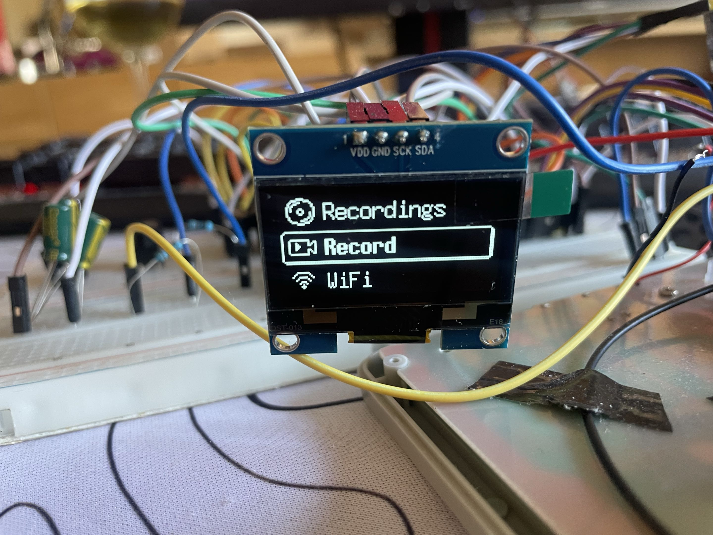
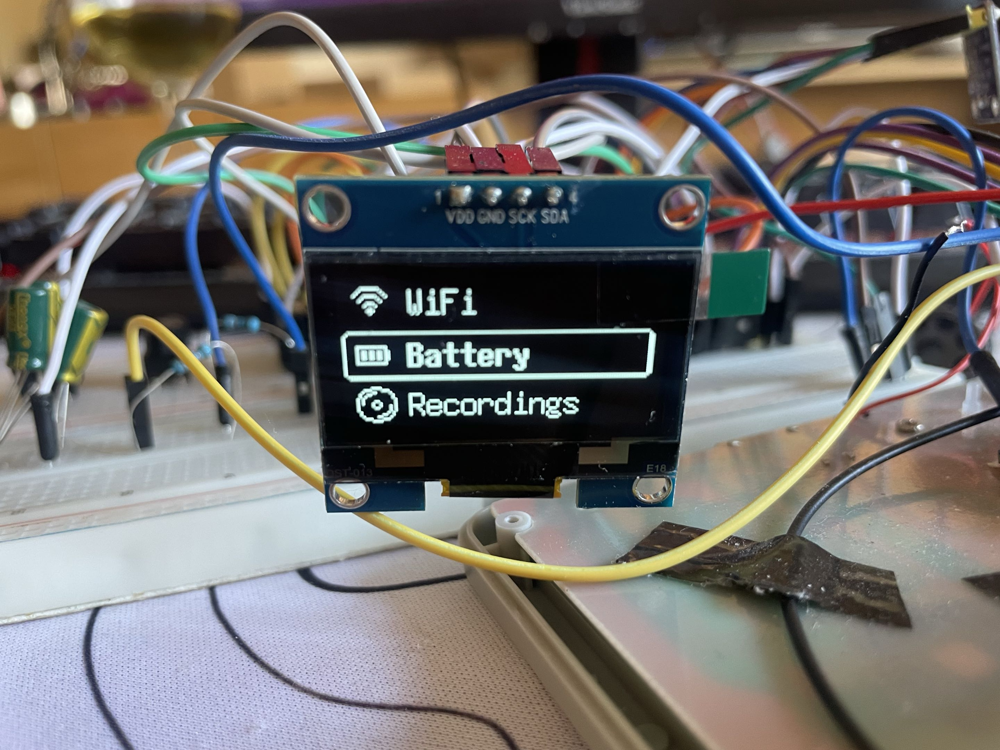
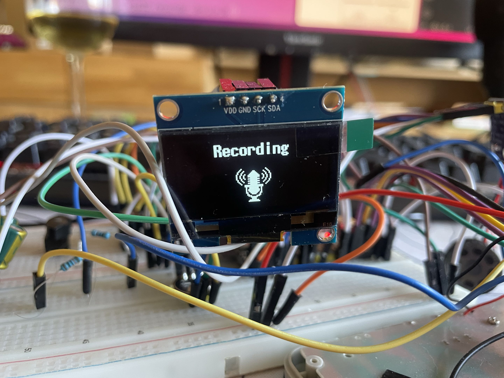
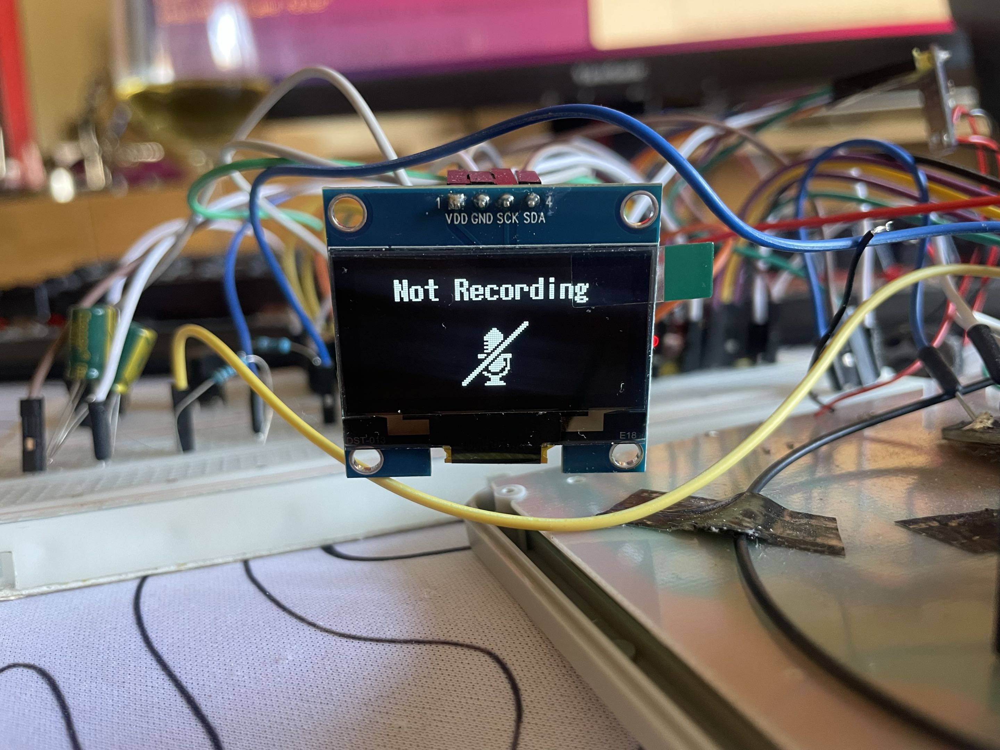
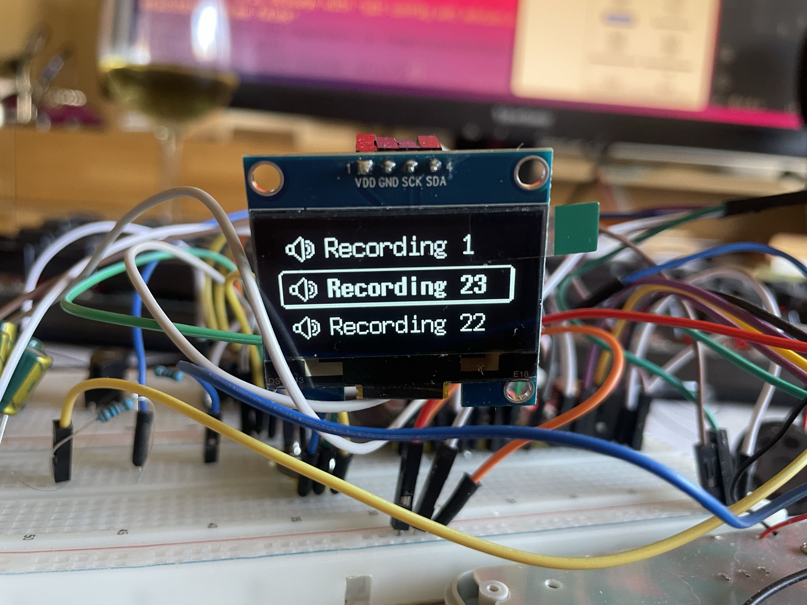
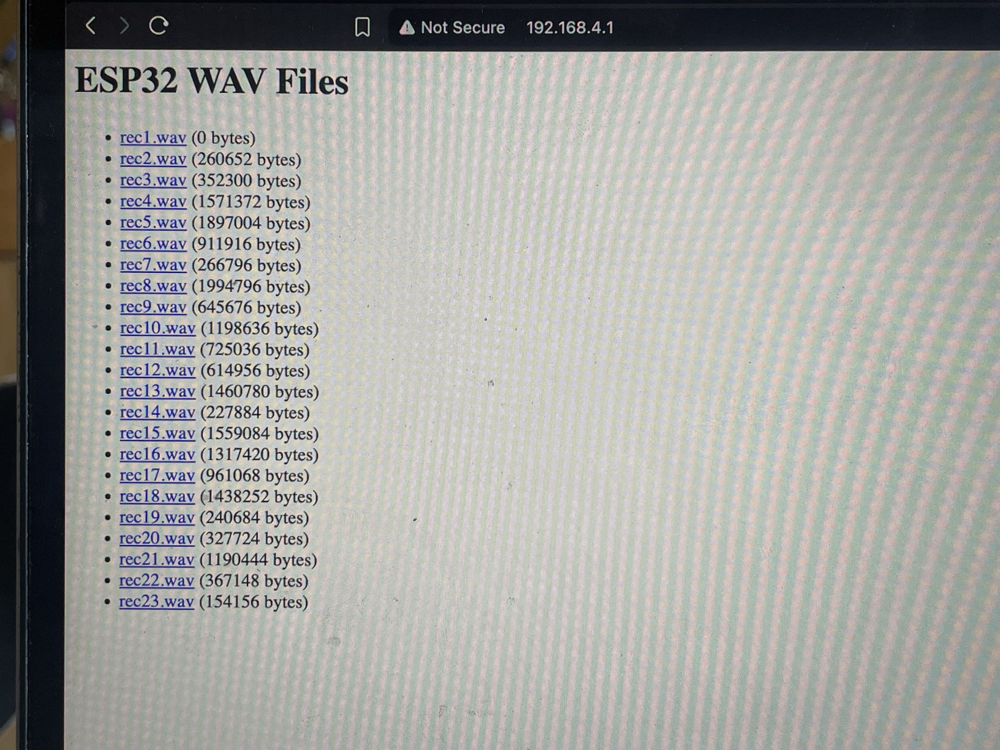
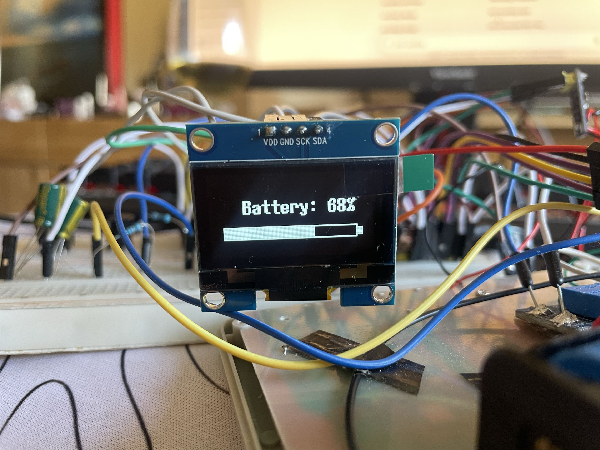

# ESP32 WAV Recorder – WiFi Audio Logger

A standalone ESP32-based audio recorder with OLED interface, SD card storage, playback support, battery monitoring, and WiFi file access. Record, play, and download WAV files directly from your device.

---

## Demo of Basic Usage


* Menu navigation
* Recording start/stop
* Playback of recordings
* WiFi file access

---

## Project Structure

```
ESP32 WAV Recorder/
│
├─ firmware/
│  └─ sketch_feb17a/
│     └─ sketch_feb17a.ino   # Arduino sketch for ESP32
│
├─ examples/
│  ├─ menu_example1.jpg
│  ├─ menu_example2.jpg
│  ├─ recording_active.jpg
│  ├─ recording_idle.jpg
│  ├─ recordings_list.jpg
│  ├─ wifi_browser.jpg
│  ├─ battery_status.jpg
│  └─ demo.gif
│
├─ README.md
└─ LICENSE
```

> **Note:** Ensure SD card, I2S, and OLED connections match the pin configuration in the code. Update paths if you reorganize files.

---

## Features

* WAV audio recording via I2S microphone
* Playback through I2S amplifier/speaker
* Automatic file saving (`rec1.wav`, `rec2.wav`, ...)
* OLED menu interface with icons and navigation
* WiFi access point for downloading recordings
* Battery voltage & percentage monitoring
* Dynamic gain control for clean audio recording
* Low-power WiFi mode (disables display + audio)

---

## Dependencies

**Arduino:**

* U8g2 (OLED display)
* SD
* SPI
* WiFi
* ESPAsyncWebServer
* I2S (built into ESP32 core)

Install via Arduino Library Manager where applicable.

---

## Setup Instructions

1. **Arduino (ESP32)**

   * Open `firmware/main/esp32_wav_recorder.ino` in Arduino IDE
   * Install required libraries
   * Connect hardware according to wiring table
   * Upload to ESP32

2. **SD Card**

   * Format as FAT32
   * Insert into ESP32 before boot

---

## Usage & Modes – Full Tutorial

This project uses a **menu-based interface** controlled by buttons. Navigate using `UP`, `DOWN`, and select with `OK`.

---

### Menu Navigation




* Scroll through:

  * Recordings
  * Record
  * WiFi
  * Battery
* Selected item is highlighted

---

### Record Mode




Controls:

* `OK` → Start recording
* `OK` again → Stop recording
* `LEFT` → Return to menu

Behavior:

* Files saved automatically as `/recX.wav`
* OLED shows recording status
* Audio is processed with automatic gain control

---

### Recordings (Playback)



Controls:

* `UP / DOWN` → Navigate recordings
* `OK` → Play selected recording
* `LEFT` → Back to menu

Behavior:

* Plays audio via I2S speaker
* Automatically detects all recorded files on SD

---

### WiFi Mode (File Access)



* ESP32 creates WiFi Access Point:

  * **SSID:** `ESP32_WAV`
  * **Password:** `12345678`

* Open browser:

  ```
  http://192.168.4.1
  ```

* Features:

  * View all recorded WAV files
  * Download recordings directly

Controls:

* `LEFT` → Exit WiFi mode

> Note: Entering WiFi mode disables OLED and audio to save power.

---

### Battery Monitor



* Displays:

  * Battery percentage
  * Visual battery bar

* Uses calibrated ADC readings with interpolation for Li-ion accuracy

Controls:

* `LEFT` → Back to menu

---

## Connections / Wiring

| Component          | Pin on Component | ESP32 / Notes |
| ------------------ | ---------------- | ------------- |
| **I2S Microphone** | BCK              | GPIO 4        |
|                    | WS               | GPIO 5        |
|                    | SD               | GPIO 6        |
| **I2S Speaker**    | BCLK             | GPIO 20       |
|                    | LRC              | GPIO 21       |
|                    | DOUT             | GPIO 45       |
| **SD Card**        | CS               | GPIO 14       |
|                    | MOSI             | GPIO 11       |
|                    | MISO             | GPIO 13       |
|                    | SCK              | GPIO 12       |
| **OLED Display**   | SDA              | GPIO 21       |
|                    | SCL              | GPIO 22       |
| **Buttons**        | UP               | GPIO 10       |
|                    | DOWN             | GPIO 7        |
|                    | LEFT             | GPIO 16       |
|                    | RIGHT            | GPIO 15       |
|                    | OK               | GPIO 17       |
| **Battery Input**  | ADC              | GPIO 2        |

---

## License

MIT License – see [LICENSE](./LICENSE)

---

## Notes

* SD card must be properly initialized before recording
* Ensure correct I2S pin configuration for your hardware
* WiFi mode reduces power usage by disabling unused peripherals
* Tested on ESP32 with I2S mic + amplifier setup
